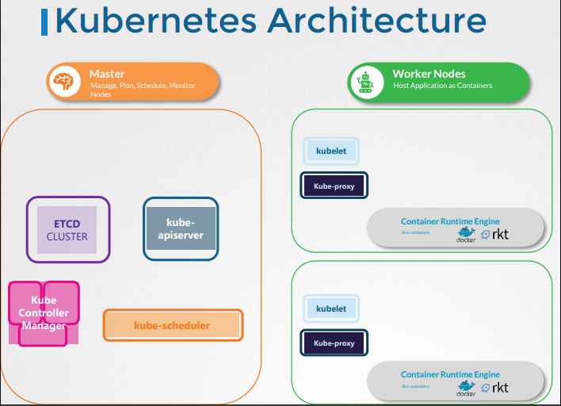

# **CKA** (Last Min Notes)

# Cluster Architecture

  - Take me to [Video Tutorial](https://kodekloud.com/topic/cluster-architecture/)

In this section , we will take a look at the kubernetes Architecture at high level.
- 10,000 Feet Look at the Kubernetes Architecture
  
  

K8s Reference Docs:
- https://kubernetes.io/docs/concepts/architecture/

<br ><br >
# ETCD for Beginners
  - Take me to the [Video Tutorial](https://kodekloud.com/topic/etcd-for-beginners/)


  
 ## What is a ETCD?
     - ETCD is a distributed reliable key-value store that is simple, secure & Fast.
     
## What is a Key-Value Store
   - Traditionally, databases have been in tabular format, you must have heared about SQL or Relational databases. They store data in rows and columns
       
     
   - A Key-Value Store stores information in a Key and Value format.
       
     
       
## Install ETCD
   - Its easy to install and get started with **`ETCD`**.
     - Download the relevant binary for your operating system from github releases page (https://github.com/etcd-io/etcd/releases)
       ```
       For Example: To download ETCD V3.3.11, run the below curl command
         
       $ https://github.com/etcd-io/etcd/releases/download/v3.3.11/etcd-v3.3.11-linux-amd64.tar.gz
       ```
     - Extract it.
       ```
       $ tar xvzf etcd-v3.3.11-linux-amd64.tar.gz 
       ```
     - Run the ETCD Service
       ```
       $ ./etcd
       ```
     - When you start **`ETCD`** it will by default listens on port **`2379`**
      - The default client that comes with **`ETCD`** is the [**`etcdctl`**](https://github.com/etcd-io/etcd/tree/main/etcdctl) client. You can use it to store and retrieve key-value pairs.
        ```
        Syntax: To Store a Key-Value pair
        $ ./etcdctl set key1 value1
        ```
        ```
        Syntax: To retrieve the stored data
        $ ./etcdctl get key1
        ```
        ```
        Syntax: To view more commands. Run etcdctl without any arguments
        $ ./etcdctl
        ```
        
        
        
       K8s Reference Docs:
       - https://kubernetes.io/docs/concepts/overview/components/
       - https://etcd.io/docs/
       - https://kubernetes.io/docs/tasks/administer-cluster/configure-upgrade-etcd/

  <br><br>

  # ETCD in Kubernetes
  - Take me to [Video Tutorial](https://kodekloud.com/topic/etcd-in-kubernetes/)

In this section, we will take a look at ETCD role in kubernetes

## ETCD Datastore
- The ETCD Datastore stores information regarding the cluster such as **`Nodes`**, **`PODS`**, **`Configs`**, **`Secrets`**, **`Accounts`**, **`Roles`**, **`Bindings`** and **`Others`**.
- Every information you see when you run the **`kubectl get`** command is from the **`ETCD Server`**.

## Setup - Manual
- If you setup your cluster from scratch then you deploy **`ETCD`** by downloading ETCD Binaries yourself
- Installing Binaries and Configuring ETCD as a service in your master node yourself.
  ```
  $ wget -q --https-only "https://github.com/etcd-io/etcd/releases/download/v3.3.11/etcd-v3.3.11-linux-amd64.tar.gz"
  ```

  
  
## Setup - Kubeadm
- If you setup your cluster using **`kubeadm`** then kubeadm will deploy etcd server for you as a pod in **`kube-system`** namespace.
  ```
  $ kubectl get pods -n kube-system
  ```
  

## Explore ETCD
- To list all keys stored by kubernetes, run the below command
  ```
  $ kubectl exec etcd-master -n kube-system etcdctl get / --prefix -key
  ```
- Kubernetes Stores data in a specific directory structure, the root directory is the **`registry`** and under that you have varies kubernetes constructs such as **`minions`**, **`nodes`**, **`pods`**, **`replicasets`**, **`deployments`**, **`roles`**, **`secrets`** and **`Others`**.
  
  

## ETCD in HA Environment
   - In a high availability environment, you will have multiple master nodes in your cluster that will have multiple ETCD Instances spread across the master nodes.
   - Make sure etcd instances know each other by setting the right parameter in the **`etcd.service`** configuration. The **`--initial-cluster`** option where you need to specify the different instances of the etcd service.
     

K8s Reference Docs:
- https://kubernetes.io/docs/tasks/administer-cluster/configure-upgrade-etcd/
- https://kubernetes.io/docs/setup/production-environment/tools/kubeadm/setup-ha-etcd-with-kubeadm/
- https://kubernetes.io/docs/setup/production-environment/tools/kubeadm/high-availability/#stacked-control-plane-and-etcd-nodes
- https://kubernetes.io/docs/setup/production-environment/tools/kubeadm/high-availability/#external-etcd-nodes

<br><br>

# Kube API Server
  - Take me to [Video Tutorial](https://kodekloud.com/topic/kube-api-server/)
  
In this section, we will talk about kube-apiserver in kubernetes

#### Kube-apiserver is the primary component in kubernetes.
- Kube-apiserver is responsible for **`authenticating`**, **`validating`** requests, **`retrieving`** and **`Updating`** data in ETCD key-value store. In fact kube-apiserver is the only component that interacts directly to the etcd datastore. The other components such as kube-scheduler, kube-controller-manager and kubelet uses the API-Server to update in the cluster in their respective areas.
  
  
  
## Installing kube-apiserver

- If you are bootstrapping kube-apiserver using **`kubeadm`** tool, then you don't need to know this, but if you are setting up using the hardway then kube-apiserver is available as a binary in the kubernetes release page.
  - For example: You can downlaod the kube-apiserver v1.13.0 binary here [kube-apiserver](https://storage.googleapis.com/kubernetes-release/release/v1.13.0/bin/linux/amd64/kube-apiserver)
    ```
    $ wget https://storage.googleapis.com/kubernetes-release/release/v1.13.0/bin/linux/amd64/kube-apiserver
    ```
 
 
 
## View kube-apiserver - Kubeadm
- kubeadm deploys the kube-apiserver as a pod in kube-system namespace on the master node.
  ```
  $ kubectl get pods -n kube-system
  ```
   
  
   
## View kube-apiserver options - Kubeadm
- You can see the options with in the pod definition file located at **`/etc/kubernetes/manifests/kube-apiserver.yaml`**
  ```
  $ cat /etc/kubernetes/manifests/kube-apiserver.yaml
  ```
  
  
   
## View kube-apiserver options - Manual
- In a Non-kubeadm setup, you can inspect the options by viewing the kube-apiserver.service
  ```
  $ cat /etc/systemd/system/kube-apiserver.service
  ```
  
  
   
- You can also see the running process and affective options by listing the process on master node and searching for kube-apiserver.
  ```
  $ ps -aux | grep kube-apiserver
  ```
  

K8s Reference Docs:
- https://kubernetes.io/docs/reference/command-line-tools-reference/kube-apiserver/
- https://kubernetes.io/docs/concepts/overview/components/
- https://kubernetes.io/docs/concepts/overview/kubernetes-api/
- https://kubernetes.io/docs/tasks/access-application-cluster/access-cluster/
- https://kubernetes.io/docs/tasks/administer-cluster/access-cluster-api/

<br><br>

# Kube Controller Manager

  - Take me to [Video Tutorial](https://kodekloud.com/topic/kube-controller-manager/)
  
In this section, we will take a look at kube-controller-manager.

#### Kube Controller Manager manages various controllers in kubernetes.
- In kubernetes terms, a controller is a process that continuously monitors the state of the components within the system and works towards bringing the whole system to the desired functioning state.

## Node Controller
   - Responsible for monitoring the state of the Nodes and taking necessary actions to keep the application running. 
  
   
   
## Replication Controller
   - It is responsible for monitoring the status of replicasets and ensuring that the desired number of pods are available at all time within the set.
   
   
   
## Other Controllers
   - There are many more such controllers available within kubernetes
     
   
   
   
  ## Installing Kube-Controller-Manager
  - When you install kube-controller-manager the different controllers will get installed as well.
  - Download the kube-controller-manager binary from the kubernetes release page. For example: You can download kube-controller-manager v1.13.0 here [kube-controller-manager](https://storage.googleapis.com/kubernetes-release/release/v1.13.0/bin/linux/amd64/kube-controller-manager)
    ```
    $ wget https://storage.googleapis.com/kubernetes-release/release/v1.13.0/bin/linux/amd64/kube-controller-manager
    ```
  - By default all controllers are enabled, but you can choose to enable specific one from **`kube-controller-manager.service`**
    ```
    $ cat /etc/systemd/system/kube-controller-manager.service
    ```
    
    
## View kube-controller-manager - kubeadm
- kubeadm deploys the kube-controller-manager as a pod in kube-system namespace
  ```
  $ kubectl get pods -n kube-system
  ```
  
  
## View kube-controller-manager options - kubeadm
- You can see the options within the pod located at **`/etc/kubernetes/manifests/kube-controller-manager.yaml`**
  ```
  $ cat /etc/kubernetes/manifests/kube-controller-manager.yaml
  ```
  
  
## View kube-controller-manager options - Manual
- In a non-kubeadm setup, you can inspect the options by viewing the **`kube-controller-manager.service`**
  ```
  $ cat /etc/systemd/system/kube-controller-manager.service
  ```
  
  
- You can also see the running process and affective options by listing the process on master node and searching for kube-controller-manager.
  ```
  $ ps -aux | grep kube-controller-manager
  ```
  
  
K8s Reference Docs:
- https://kubernetes.io/docs/reference/command-line-tools-reference/kube-controller-manager/
- https://kubernetes.io/docs/concepts/overview/components/
   
<br><br>

# Kube Scheduler
  - Take me to [Video Tutorial](https://kodekloud.com/topic/kube-scheduler/)

In this section, we will take a look at kube-scheduler.

#### kube-scheduler is responsible for scheduling pods on nodes.  
- The kube-scheduler is only responsible for deciding which pod goes on which node. It doesn't actually place the pod on the nodes, that's the job of the **`kubelet`**.

  
  
#### Why do you need a Scheduler?

  
    
## Install kube-scheduler - Manual
- Download the kubescheduler binary from the kubernetes release pages [kube-scheduler](https://storage.googleapis.com/kubernetes-release/release/v1.13.0/bin/linux/amd64/kube-scheduler). For example: To download kube-scheduler v1.13.0, Run the below command.
  ```
  $ wget https://storage.googleapis.com/kubernetes-release/release/v1.13.0/bin/linux/amd64/kube-scheduler
  ```
- Extract it
- Run it as a service

  
  
## View kube-scheduler options - kubeadm
- If you set it up with kubeadm tool, kubeadm tool will deploy the kube-scheduler as pod in kube-system namespace on master node.
  ```
  $ kubectl get pods -n kube-system
  ```
- You can see the options for kube-scheduler in pod definition file that is located at **`/etc/kubernetes/manifests/kube-scheduler.yaml`**
  ```
  $ cat /etc/kubernetes/manifests/kube-scheduler.yaml
  ```
  
  
- You can also see the running process and affective options by listing the process on master node and searching for kube-apiserver.
  ``` 
  $ ps -aux | grep kube-scheduler
  ```
  
  
  K8s Reference Docs:
  - https://kubernetes.io/docs/reference/command-line-tools-reference/kube-scheduler/
  - https://kubernetes.io/docs/concepts/scheduling-eviction/kube-scheduler/
  - https://kubernetes.io/docs/concepts/overview/components/
  - https://kubernetes.io/docs/tasks/extend-kubernetes/configure-multiple-schedulers/
    
<br><br>

# Kubelet
  - Take me to [Video Tutorial](https://kodekloud.com/topic/kubelet/)
  
In this section we will take a look at kubelet.

#### Kubelet is the sole point of contact for the kubernetes cluster
- The **`kubelet`** will create the pods on the nodes, the scheduler only decides which pods goes where.

  
  
## Install kubelet
- Kubeadm does not deploy kubelet by default. You must manually download and install it.
- Download the kubelet binary from the kubernetes release pages [kubelet](https://storage.googleapis.com/kubernetes-release/release/v1.13.0/bin/linux/amd64/kubelet). For example: To download kubelet v1.13.0, Run the below command.
  ```
  $ wget https://storage.googleapis.com/kubernetes-release/release/v1.13.0/bin/linux/amd64/kubelet
  ```
- Extract it
- Run it as a service

  
  
## View kubelet options
- You can also see the running process and affective options by listing the process on worker node and searching for kubelet.
  ``` 
  $ ps -aux |grep kubelet
  ```
  
  

K8s Reference Docs:
- https://kubernetes.io/docs/reference/command-line-tools-reference/kubelet/
- https://kubernetes.io/docs/concepts/overview/components/
- https://kubernetes.io/docs/setup/production-environment/tools/kubeadm/kubelet-integration/

<br><br>

# Kube Proxy
- Take me to [Video Tutorial](https://kodekloud.com/topic/kube-proxy/)

In this section, we will take a look at kube-proxy.

Within Kubernetes Cluster, every pod can reach every other pod, this is accomplish by deploying a pod networking cluster to the cluster. 
- Kube-Proxy is a process that runs on each node in the kubernetes cluster.
  
  
  
## Install kube-proxy - Manual
- Download the kube-proxy binary from the kubernetes release pages [kube-proxy](https://storage.googleapis.com/kubernetes-release/release/v1.13.0/bin/linux/amd64/kube-proxy). For example: To download kube-proxy v1.13.0, Run the below command.
  ```
  $ wget https://storage.googleapis.com/kubernetes-release/release/v1.13.0/bin/linux/amd64/kube-proxy
  ```
- Extract it
- Run it as a service

  

## View kube-proxy options - kubeadm
- If you set it up with kubeadm tool, kubeadm tool will deploy the kube-proxy as pod in kube-system namespace. In fact it is deployed as a daemonset on master node.
  ```
  $ kubectl get pods -n kube-system
  ```
  
  
  
K8s Reference Docs:
- https://kubernetes.io/docs/reference/command-line-tools-reference/kube-proxy/
- https://kubernetes.io/docs/concepts/overview/components/

<br><br>
<br><br>

# Pods
  - Take me to [Video Tutorial](https://kodekloud.com/topic/pods-2/)
  
In this section, we will take a look at PODS.
- POD introduction
- How to deploy pod?

#### Kubernetes doesn't deploy containers directly on the worker node.

  
  
#### Here is a single node kubernetes cluster with single instance of your application running in a single docker container encapsulated in the pod.


#### Pod will have a one-to-one relationship with containers running your application.

  
  
## Multi-Container PODs
- A single pod can have multiple containers except for the fact that they are usually not multiple containers of the **`same kind`**.
  
  
  
## Docker Example (Docker Link)
  
  
  
## How to deploy pods?
Lets now take a look to create a nginx pod using **`kubectl`**.

- To deploy a docker container by creating a POD.
  ```
  $ kubectl run nginx --image nginx
  ```

- To get the list of pods
  ```
  $ kubectl get pods
  ```

 

K8s Reference Docs:
- https://kubernetes.io/docs/concepts/workloads/pods/pod/
- https://kubernetes.io/docs/concepts/workloads/pods/pod-overview/
- https://kubernetes.io/docs/tutorials/kubernetes-basics/explore/explore-intro/

