# **CKA** (Last Min Notes)

# Cluster Architecture

  - Take me to [Video Tutorial](https://kodekloud.com/topic/cluster-architecture/)

In this section , we will take a look at the kubernetes Architecture at high level.
- 10,000 Feet Look at the Kubernetes Architecture
  
  

K8s Reference Docs:
- https://kubernetes.io/docs/concepts/architecture/

<br ><br >
# ETCD for Beginners
  - Take me to the [Video Tutorial](https://kodekloud.com/topic/etcd-for-beginners/)


  
 ## What is a ETCD?
     - ETCD is a distributed reliable key-value store that is simple, secure & Fast.
     
## What is a Key-Value Store
   - Traditionally, databases have been in tabular format, you must have heared about SQL or Relational databases. They store data in rows and columns
       
     
   - A Key-Value Store stores information in a Key and Value format.
       
     
       
## Install ETCD
   - Its easy to install and get started with **`ETCD`**.
     - Download the relevant binary for your operating system from github releases page (https://github.com/etcd-io/etcd/releases)
       ```
       For Example: To download ETCD V3.3.11, run the below curl command
         
       $ https://github.com/etcd-io/etcd/releases/download/v3.3.11/etcd-v3.3.11-linux-amd64.tar.gz
       ```
     - Extract it.
       ```
       $ tar xvzf etcd-v3.3.11-linux-amd64.tar.gz 
       ```
     - Run the ETCD Service
       ```
       $ ./etcd
       ```
     - When you start **`ETCD`** it will by default listens on port **`2379`**
      - The default client that comes with **`ETCD`** is the [**`etcdctl`**](https://github.com/etcd-io/etcd/tree/main/etcdctl) client. You can use it to store and retrieve key-value pairs.
        ```
        Syntax: To Store a Key-Value pair
        $ ./etcdctl set key1 value1
        ```
        ```
        Syntax: To retrieve the stored data
        $ ./etcdctl get key1
        ```
        ```
        Syntax: To view more commands. Run etcdctl without any arguments
        $ ./etcdctl
        ```
        
        
        
       K8s Reference Docs:
       - https://kubernetes.io/docs/concepts/overview/components/
       - https://etcd.io/docs/
       - https://kubernetes.io/docs/tasks/administer-cluster/configure-upgrade-etcd/

  <br><br>

  # ETCD in Kubernetes
  - Take me to [Video Tutorial](https://kodekloud.com/topic/etcd-in-kubernetes/)

In this section, we will take a look at ETCD role in kubernetes

## ETCD Datastore
- The ETCD Datastore stores information regarding the cluster such as **`Nodes`**, **`PODS`**, **`Configs`**, **`Secrets`**, **`Accounts`**, **`Roles`**, **`Bindings`** and **`Others`**.
- Every information you see when you run the **`kubectl get`** command is from the **`ETCD Server`**.

## Setup - Manual
- If you setup your cluster from scratch then you deploy **`ETCD`** by downloading ETCD Binaries yourself
- Installing Binaries and Configuring ETCD as a service in your master node yourself.
  ```
  $ wget -q --https-only "https://github.com/etcd-io/etcd/releases/download/v3.3.11/etcd-v3.3.11-linux-amd64.tar.gz"
  ```

  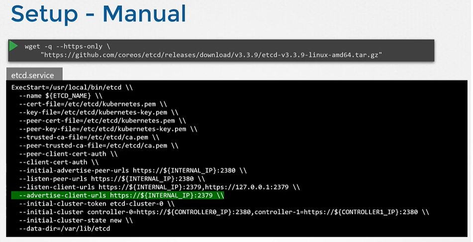
  
## Setup - Kubeadm
- If you setup your cluster using **`kubeadm`** then kubeadm will deploy etcd server for you as a pod in **`kube-system`** namespace.
  ```
  $ kubectl get pods -n kube-system
  ```
  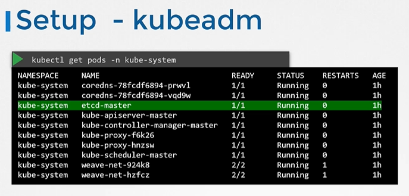

## Explore ETCD
- To list all keys stored by kubernetes, run the below command
  ```
  $ kubectl exec etcd-master -n kube-system etcdctl get / --prefix -key
  ```
- Kubernetes Stores data in a specific directory structure, the root directory is the **`registry`** and under that you have varies kubernetes constructs such as **`minions`**, **`nodes`**, **`pods`**, **`replicasets`**, **`deployments`**, **`roles`**, **`secrets`** and **`Others`**.
  
  

## ETCD in HA Environment
   - In a high availability environment, you will have multiple master nodes in your cluster that will have multiple ETCD Instances spread across the master nodes.
   - Make sure etcd instances know each other by setting the right parameter in the **`etcd.service`** configuration. The **`--initial-cluster`** option where you need to specify the different instances of the etcd service.
     

K8s Reference Docs:
- https://kubernetes.io/docs/tasks/administer-cluster/configure-upgrade-etcd/
- https://kubernetes.io/docs/setup/production-environment/tools/kubeadm/setup-ha-etcd-with-kubeadm/
- https://kubernetes.io/docs/setup/production-environment/tools/kubeadm/high-availability/#stacked-control-plane-and-etcd-nodes
- https://kubernetes.io/docs/setup/production-environment/tools/kubeadm/high-availability/#external-etcd-nodes

<br><br>

# Kube API Server
  - Take me to [Video Tutorial](https://kodekloud.com/topic/kube-api-server/)
  
In this section, we will talk about kube-apiserver in kubernetes

#### Kube-apiserver is the primary component in kubernetes.
- Kube-apiserver is responsible for **`authenticating`**, **`validating`** requests, **`retrieving`** and **`Updating`** data in ETCD key-value store. In fact kube-apiserver is the only component that interacts directly to the etcd datastore. The other components such as kube-scheduler, kube-controller-manager and kubelet uses the API-Server to update in the cluster in their respective areas.
  
  
  
## Installing kube-apiserver

- If you are bootstrapping kube-apiserver using **`kubeadm`** tool, then you don't need to know this, but if you are setting up using the hardway then kube-apiserver is available as a binary in the kubernetes release page.
  - For example: You can downlaod the kube-apiserver v1.13.0 binary here [kube-apiserver](https://storage.googleapis.com/kubernetes-release/release/v1.13.0/bin/linux/amd64/kube-apiserver)
    ```
    $ wget https://storage.googleapis.com/kubernetes-release/release/v1.13.0/bin/linux/amd64/kube-apiserver
    ```
 
 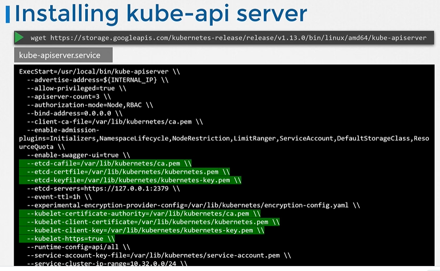
 
## View kube-apiserver - Kubeadm
- kubeadm deploys the kube-apiserver as a pod in kube-system namespace on the master node.
  ```
  $ kubectl get pods -n kube-system
  ```
   
  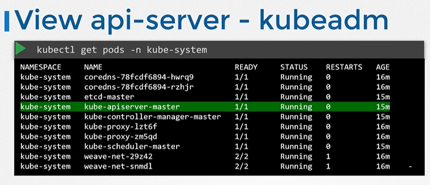
   
## View kube-apiserver options - Kubeadm
- You can see the options with in the pod definition file located at **`/etc/kubernetes/manifests/kube-apiserver.yaml`**
  ```
  $ cat /etc/kubernetes/manifests/kube-apiserver.yaml
  ```
  
  
   
## View kube-apiserver options - Manual
- In a Non-kubeadm setup, you can inspect the options by viewing the kube-apiserver.service
  ```
  $ cat /etc/systemd/system/kube-apiserver.service
  ```
  
  
   
- You can also see the running process and affective options by listing the process on master node and searching for kube-apiserver.
  ```
  $ ps -aux | grep kube-apiserver
  ```
  

K8s Reference Docs:
- https://kubernetes.io/docs/reference/command-line-tools-reference/kube-apiserver/
- https://kubernetes.io/docs/concepts/overview/components/
- https://kubernetes.io/docs/concepts/overview/kubernetes-api/
- https://kubernetes.io/docs/tasks/access-application-cluster/access-cluster/
- https://kubernetes.io/docs/tasks/administer-cluster/access-cluster-api/

<br><br>

# Kube Controller Manager

  - Take me to [Video Tutorial](https://kodekloud.com/topic/kube-controller-manager/)
  
In this section, we will take a look at kube-controller-manager.

#### Kube Controller Manager manages various controllers in kubernetes.
- In kubernetes terms, a controller is a process that continuously monitors the state of the components within the system and works towards bringing the whole system to the desired functioning state.

## Node Controller
   - Responsible for monitoring the state of the Nodes and taking necessary actions to keep the application running. 
  
   
   
## Replication Controller
   - It is responsible for monitoring the status of replicasets and ensuring that the desired number of pods are available at all time within the set.
   
   
   
## Other Controllers
   - There are many more such controllers available within kubernetes
     
   
   
   
  ## Installing Kube-Controller-Manager
  - When you install kube-controller-manager the different controllers will get installed as well.
  - Download the kube-controller-manager binary from the kubernetes release page. For example: You can download kube-controller-manager v1.13.0 here [kube-controller-manager](https://storage.googleapis.com/kubernetes-release/release/v1.13.0/bin/linux/amd64/kube-controller-manager)
    ```
    $ wget https://storage.googleapis.com/kubernetes-release/release/v1.13.0/bin/linux/amd64/kube-controller-manager
    ```
  - By default all controllers are enabled, but you can choose to enable specific one from **`kube-controller-manager.service`**
    ```
    $ cat /etc/systemd/system/kube-controller-manager.service
    ```
    
    
## View kube-controller-manager - kubeadm
- kubeadm deploys the kube-controller-manager as a pod in kube-system namespace
  ```
  $ kubectl get pods -n kube-system
  ```
  
  
## View kube-controller-manager options - kubeadm
- You can see the options within the pod located at **`/etc/kubernetes/manifests/kube-controller-manager.yaml`**
  ```
  $ cat /etc/kubernetes/manifests/kube-controller-manager.yaml
  ```
  
  
## View kube-controller-manager options - Manual
- In a non-kubeadm setup, you can inspect the options by viewing the **`kube-controller-manager.service`**
  ```
  $ cat /etc/systemd/system/kube-controller-manager.service
  ```
  
  
- You can also see the running process and affective options by listing the process on master node and searching for kube-controller-manager.
  ```
  $ ps -aux | grep kube-controller-manager
  ```
  
  
K8s Reference Docs:
- https://kubernetes.io/docs/reference/command-line-tools-reference/kube-controller-manager/
- https://kubernetes.io/docs/concepts/overview/components/
   
<br><br>

# Kube Scheduler
  - Take me to [Video Tutorial](https://kodekloud.com/topic/kube-scheduler/)

In this section, we will take a look at kube-scheduler.

#### kube-scheduler is responsible for scheduling pods on nodes.  
- The kube-scheduler is only responsible for deciding which pod goes on which node. It doesn't actually place the pod on the nodes, that's the job of the **`kubelet`**.

  
  
#### Why do you need a Scheduler?

  
    
## Install kube-scheduler - Manual
- Download the kubescheduler binary from the kubernetes release pages [kube-scheduler](https://storage.googleapis.com/kubernetes-release/release/v1.13.0/bin/linux/amd64/kube-scheduler). For example: To download kube-scheduler v1.13.0, Run the below command.
  ```
  $ wget https://storage.googleapis.com/kubernetes-release/release/v1.13.0/bin/linux/amd64/kube-scheduler
  ```
- Extract it
- Run it as a service

  
  
## View kube-scheduler options - kubeadm
- If you set it up with kubeadm tool, kubeadm tool will deploy the kube-scheduler as pod in kube-system namespace on master node.
  ```
  $ kubectl get pods -n kube-system
  ```
- You can see the options for kube-scheduler in pod definition file that is located at **`/etc/kubernetes/manifests/kube-scheduler.yaml`**
  ```
  $ cat /etc/kubernetes/manifests/kube-scheduler.yaml
  ```
  
  
- You can also see the running process and affective options by listing the process on master node and searching for kube-apiserver.
  ``` 
  $ ps -aux | grep kube-scheduler
  ```
  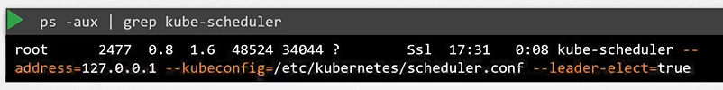
  
  K8s Reference Docs:
  - https://kubernetes.io/docs/reference/command-line-tools-reference/kube-scheduler/
  - https://kubernetes.io/docs/concepts/scheduling-eviction/kube-scheduler/
  - https://kubernetes.io/docs/concepts/overview/components/
  - https://kubernetes.io/docs/tasks/extend-kubernetes/configure-multiple-schedulers/
    
<br><br>

# Kubelet
  - Take me to [Video Tutorial](https://kodekloud.com/topic/kubelet/)
  
In this section we will take a look at kubelet.

#### Kubelet is the sole point of contact for the kubernetes cluster
- The **`kubelet`** will create the pods on the nodes, the scheduler only decides which pods goes where.

  
  
## Install kubelet
- Kubeadm does not deploy kubelet by default. You must manually download and install it.
- Download the kubelet binary from the kubernetes release pages [kubelet](https://storage.googleapis.com/kubernetes-release/release/v1.13.0/bin/linux/amd64/kubelet). For example: To download kubelet v1.13.0, Run the below command.
  ```
  $ wget https://storage.googleapis.com/kubernetes-release/release/v1.13.0/bin/linux/amd64/kubelet
  ```
- Extract it
- Run it as a service

  
  
## View kubelet options
- You can also see the running process and affective options by listing the process on worker node and searching for kubelet.
  ``` 
  $ ps -aux |grep kubelet
  ```
  
  

K8s Reference Docs:
- https://kubernetes.io/docs/reference/command-line-tools-reference/kubelet/
- https://kubernetes.io/docs/concepts/overview/components/
- https://kubernetes.io/docs/setup/production-environment/tools/kubeadm/kubelet-integration/

<br><br>

# Kube Proxy
- Take me to [Video Tutorial](https://kodekloud.com/topic/kube-proxy/)

In this section, we will take a look at kube-proxy.

Within Kubernetes Cluster, every pod can reach every other pod, this is accomplish by deploying a pod networking cluster to the cluster. 
- Kube-Proxy is a process that runs on each node in the kubernetes cluster.
  
  
  
## Install kube-proxy - Manual
- Download the kube-proxy binary from the kubernetes release pages [kube-proxy](https://storage.googleapis.com/kubernetes-release/release/v1.13.0/bin/linux/amd64/kube-proxy). For example: To download kube-proxy v1.13.0, Run the below command.
  ```
  $ wget https://storage.googleapis.com/kubernetes-release/release/v1.13.0/bin/linux/amd64/kube-proxy
  ```
- Extract it
- Run it as a service

  

## View kube-proxy options - kubeadm
- If you set it up with kubeadm tool, kubeadm tool will deploy the kube-proxy as pod in kube-system namespace. In fact it is deployed as a daemonset on master node.
  ```
  $ kubectl get pods -n kube-system
  ```
  
  
  
K8s Reference Docs:
- https://kubernetes.io/docs/reference/command-line-tools-reference/kube-proxy/
- https://kubernetes.io/docs/concepts/overview/components/

<br><br>
<br><br>

# Pods
  - Take me to [Video Tutorial](https://kodekloud.com/topic/pods-2/)
  
In this section, we will take a look at PODS.
- POD introduction
- How to deploy pod?

#### Kubernetes doesn't deploy containers directly on the worker node.

  
  
#### Here is a single node kubernetes cluster with single instance of your application running in a single docker container encapsulated in the pod.


#### Pod will have a one-to-one relationship with containers running your application.

  
  
## Multi-Container PODs
- A single pod can have multiple containers except for the fact that they are usually not multiple containers of the **`same kind`**.
  
  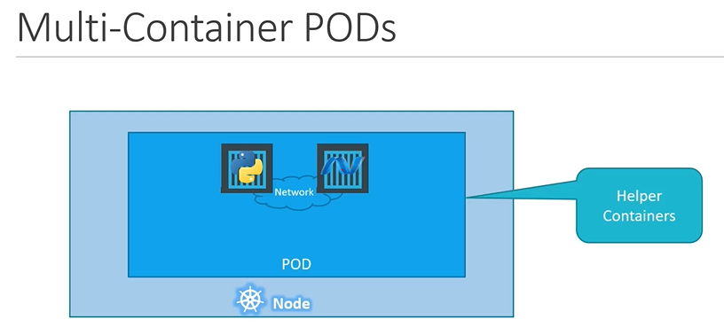
  
## Docker Example (Docker Link)
  
  
  
## How to deploy pods?
Lets now take a look to create a nginx pod using **`kubectl`**.

- To deploy a docker container by creating a POD.
  ```
  $ kubectl run nginx --image nginx
  ```

- To get the list of pods
  ```
  $ kubectl get pods
  ```

 

K8s Reference Docs:
- https://kubernetes.io/docs/concepts/workloads/pods/pod/
- https://kubernetes.io/docs/concepts/workloads/pods/pod-overview/
- https://kubernetes.io/docs/tutorials/kubernetes-basics/explore/explore-intro/

<br><br><br>

# ReplicaSets
  - Take me to [Video Tutorial](https://kodekloud.com/topic/replicasets/)

In this section, we will take a look at the below
- Replication Controller
- ReplicaSet

#### Controllers are brain behind kubernetes

## What is a Replica and Why do we need a replication controller?

  
  
  
  
## Difference between ReplicaSet and Replication Controller
- **`Replication Controller`** is the older technology that is being replaced by a **`ReplicaSet`**.
- **`ReplicaSet`** is the new way to setup replication.

## Creating a Replication Controller

## Replication Controller Definition File
  
   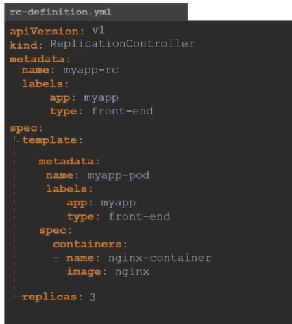
  
```
    apiVersion: v1
    kind: ReplicationController
    metadata:
      name: myapp-rc
      labels:
        app: myapp
        type: front-end
    spec:
     template:
        metadata:
          name: myapp-pod
          labels:
            app: myapp
            type: front-end
        spec:
         containers:
         - name: nginx-container
           image: nginx
     replicas: 3
```
  - To Create the replication controller
    ```
    $ kubectl create -f rc-definition.yaml
    ```
  - To list all the replication controllers
    ```
    $ kubectl get replicationcontroller
    ```
  - To list pods that are launch by the replication controller
    ```
    $ kubectl get pods
    ```
    
    
## Creating a ReplicaSet
  
## ReplicaSet Definition File

   

```
    apiVersion: apps/v1
    kind: ReplicaSet
    metadata:
      name: myapp-replicaset
      labels:
        app: myapp
        type: front-end
    spec:
     template:
        metadata:
          name: myapp-pod
          labels:
            app: myapp
            type: front-end
        spec:
         containers:
         - name: nginx-container
           image: nginx
     replicas: 3
     selector:
       matchLabels:
        type: front-end
 ```
#### ReplicaSet requires a selector definition when compare to Replication Controller.
   
  - To Create the replicaset
    ```
    $ kubectl create -f replicaset-definition.yaml
    ```
  - To list all the replicaset
    ```
    $ kubectl get replicaset
    ```
  - To list pods that are launch by the replicaset
    ```
    $ kubectl get pods
    ```
   
    
    
## Labels and Selectors
#### What is the deal with Labels and Selectors? Why do we label pods and objects in kubernetes?

  
  
## How to scale replicaset
- There are multiple ways to scale replicaset
  - First way is to update the number of replicas in the replicaset-definition.yaml definition file. E.g replicas: 6 and then run 
 ```
    apiVersion: apps/v1
    kind: ReplicaSet
    metadata:
      name: myapp-replicaset
      labels:
        app: myapp
        type: front-end
    spec:
     template:
        metadata:
          name: myapp-pod
          labels:
            app: myapp
            type: front-end
        spec:
         containers:
         - name: nginx-container
           image: nginx
     replicas: 6
     selector:
       matchLabels:
        type: front-end
```

  ```
  $ kubectl apply -f replicaset-definition.yaml
  ```
  - Second way is to use **`kubectl scale`** command.
  ```
  $ kubectl scale --replicas=6 -f replicaset-definition.yaml
  ```
  - Third way is to use **`kubectl scale`** command with type and name
  ```
  $ kubectl scale --replicas=6 replicaset myapp-replicaset
  ```
  

#### K8s Reference Docs:
- https://kubernetes.io/docs/concepts/workloads/controllers/replicaset/
- https://kubernetes.io/docs/concepts/workloads/controllers/replicationcontroller/

<br><br><br>

# Deployments
  - Take me to [Video Tutorial](https://kodekloud.com/topic/deployments-3/)

In this section, we will take a look at kubernetes deployments

#### Deployment is a kubernetes object. 
  
 
  
#### How do we create deployment?

```
    apiVersion: apps/v1
    kind: Deployment
    metadata:
      name: myapp-deployment
      labels:
        app: myapp
        type: front-end
    spec:
     template:
        metadata:
          name: myapp-pod
          labels:
            app: myapp
            type: front-end
        spec:
         containers:
         - name: nginx-container
           image: nginx
     replicas: 3
     selector:
       matchLabels:
        type: front-end
 ```
- Once the file is ready, create the deployment using deployment definition file
  ```
  $ kubectl create -f deployment-definition.yaml
  ```
- To see the created deployment
  ```
  $ kubectl get deployment
  ```
- The deployment automatically creates a **`ReplicaSet`**. To see the replicasets
  ```
  $ kubectl get replicaset
  ```
- The replicasets ultimately creates **`PODs`**. To see the PODs
  ```
  $ kubectl get pods
  ```
    
  
  
- To see the all objects at once
  ```
  $ kubectl get all
  ```
  
  
K8s Reference Docs:
- https://kubernetes.io/docs/concepts/workloads/controllers/deployment/
- https://kubernetes.io/docs/tutorials/kubernetes-basics/deploy-app/deploy-intro/
- https://kubernetes.io/docs/concepts/cluster-administration/manage-deployment/
- https://kubernetes.io/docs/concepts/overview/working-with-objects/kubernetes-objects/

<br><br><br>

# Namespaces
  - Take me to [Video Tutorial](https://kodekloud.com/topic/namespaces/)
  
In this section, we will take a look at **`Namespaces`**

So far in this course we have created **`Objects`** such as **`PODs`**, **`Deployments`** and **`Services`** in our cluster. Whatever we have been doing we have been doing in a **`NAMESPACE`**.
- This namespace is the **`default`** namespace in kubernetes. It is automatically created when kubernetes is setup initially.

  
 
- You can create your own namespaces as well.

  
  
- To list the pods in default namespace
  ```
  $ kubectl get pods
  ```
- To list the pods in another namespace. Use **`kubectl get pods`** command along with the **`--namespace`** flag or argument.
  ```
  $ kubectl get pods --namespace=kube-system
  ```
  
  
- Here we have a pod definition file, when we create a pod with pod-definition file, the pod is created in the default namespace.

```
apiVersion: v1
kind: Pod
metadata:
  name: myapp-pod
  labels:
     app: myapp
     type: front-end
spec:
  containers:
  - name: nginx-container
    image: nginx
 ```
  ```
  $ kubectl create -f pod-definition.yaml
  ```
- To create the pod with the pod-definition file in another namespace, use the **`--namespace`** option.
  ```
  $ kubectl create -f pod-definition.yaml --namespace=dev
  ```
  

- If you want to make sure that this pod gets you created in the **`dev`** env all the time, even if you don't specify in the command line, you can move the **`--namespace`** definition into the pod-definition file.
```
apiVersion: v1
kind: Pod
metadata:
  name: myapp-pod
  namespace: dev
  labels:
     app: myapp
     type: front-end
spec:
  containers:
  - name: nginx-container
    image: nginx
 ```
  
  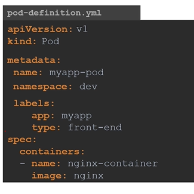
  
- To create a new namespace, create a namespace definition as shown below and then run **`kubectl create`**
```
apiVersion: v1
kind: Namespace
metadata:
  name: dev
```

  ```
  $ kubectl create -f namespace-dev.yaml
  ```
  Another way to create a namespace
  ```
  $ kubectl create namespace dev
  ```
  
  
- By default, we will be in a **`default`** namespace. To switch to a particular namespace permenently run the below command.
  ```
  $ kubectl config set-context $(kubectl config current-context) --namespace=dev
  ```
- To view pods in all namespaces
  ```
  $ kubectl get pods --all-namespaces
  ```
  
  
- To limit resources in a namespace, create a resource quota. To create one start with **`ResourceQuota`** definition file.
```
apiVersion: v1
kind: ResourceQuota
metadata:
  name: compute-quota
  namespace: dev
spec:
  hard:
    pods: "10"
    requests.cpu: "4"
    requests.memory: 5Gi
    limits.cpu: "10"
    limits.memory: 10Gi
```
  ```
  $ kubectl create -f compute-quota.yaml
  ```
  
  
K8s Reference Docs:
- https://kubernetes.io/docs/concepts/overview/working-with-objects/namespaces/
- https://kubernetes.io/docs/tasks/administer-cluster/namespaces-walkthrough/
- https://kubernetes.io/docs/tasks/administer-cluster/namespaces/
- https://kubernetes.io/docs/tasks/administer-cluster/manage-resources/quota-memory-cpu-namespace/
- https://kubernetes.io/docs/tasks/access-application-cluster/list-all-running-container-images/
  
<br><br><br>

# Kubernetes Services
  - Take me to [Video Tutorial](https://kodekloud.com/topic/services-3/)
  
In this section we will take a look at **`services`** in kubernetes

## Services
- Kubernetes Services enables communication between various components within and outside of the application.

  
  
#### Let's look at some other aspects of networking

## External Communication

- How do we as an **`external user`** access the **`web page`**?

  - From the node (Able to reach the application as expected)
  
    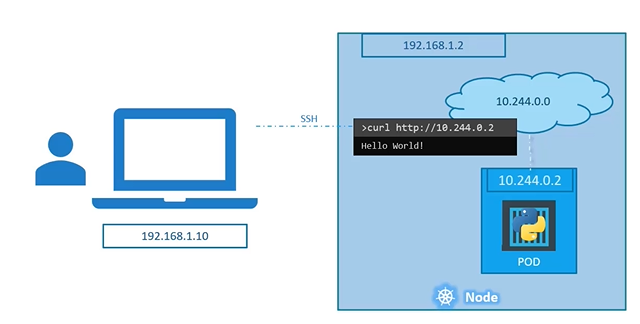
    
  - From outside world (This should be our expectation, without something in the middle it will not reach the application)
  
    
   
    
 ## Service Types
 
 #### There are 3 types of service types in kubernetes
 
   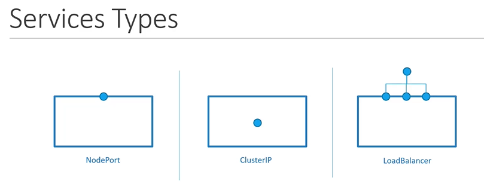
 
 1. NodePort
    - Where the service makes an internal POD accessible on a POD on the NODE.
      ```
      apiVersion: v1
      kind: Service
      metadata:
       name: myapp-service
      spec:
       types: NodePort
       ports:
       - targetPort: 80
         port: 80
         nodePort: 30008
      ```
     
      
      #### To connect the service to the pod
      ```
      apiVersion: v1
      kind: Service
      metadata:
       name: myapp-service
      spec:
       types: NodePort
       ports:
       - targetPort: 80
         port: 80
         nodePort: 30008
       selector:
         app: myapp
         type: front-end
       ```

    
      
      #### To create the service
      ```
      $ kubectl create -f service-definition.yaml
      ```
      
      #### To list the services
      ```
      $ kubectl get services
      ```
      
      #### To access the application from CLI instead of web browser
      ```
      $ curl http://192.168.1.2:30008
      ```
      
      

      #### A service with multiple pods
      
      
      
      #### When Pods are distributed across multiple nodes
     
      
     
            
 1. ClusterIP
    - In this case the service creates a **`Virtual IP`** inside the cluster to enable communication between different services such as a set of frontend servers to a set of backend servers.
    
 1. LoadBalancer
    - Where the service provisions a **`loadbalancer`** for our application in supported cloud providers.
    
K8s Reference Docs:
- https://kubernetes.io/docs/concepts/services-networking/service/
- https://kubernetes.io/docs/tutorials/kubernetes-basics/expose/expose-intro/

<br><br><br>

# Kubernetes Services - ClusterIP
  - Take me to [Video Tutorial](https://kodekloud.com/topic/services-cluster-ip-2/)
  
In this section we will take a look at **`services - ClusterIP`** in kubernetes
         
## ClusterIP
- In this case the service creates a **`Virtual IP`** inside the cluster to enable communication between different services such as a set of frontend servers to a set of backend servers.
    
    
    
#### What is a right way to establish connectivity between these services or tiers  
- A kubernetes service can help us group the pods together and provide a single interface to access the pod in a group.

  
  
#### To create a service of type ClusterIP
```
apiVersion: v1
kind: Service
metadata:
 name: back-end
spec:
 types: ClusterIP
 ports:
 - targetPort: 80
   port: 80
 selector:
   app: myapp
   type: back-end
```
```
$ kubectl create -f service-definition.yaml
```

#### To list the services
```
$ kubectl get services
```
  
   
K8s Reference Docs:
- https://kubernetes.io/docs/concepts/services-networking/service/
- https://kubernetes.io/docs/tutorials/kubernetes-basics/expose/expose-intro/

<br><br><br>

# Manual Scheduling
  - Take me to [Video Tutorial](https://kodekloud.com/topic/manual-scheduling/)
  
In this section, we will take a look at **`Manually Scheduling`** a **`POD`** on a node.

## How Scheduling Works
- What do you do when you do not have a scheduler in your cluster?
  - Every POD has a field called NodeName that by default is not set. You don't typically specify this field when you create the manifest file, kubernetes adds it automatically.
  - Once identified it schedules the POD on the node by setting the nodeName property to the name of the node by creating a binding object.
    ```
    apiVersion: v1
    kind: Pod
    metadata:
     name: nginx
     labels:
      name: nginx
    spec:
     containers:
     - name: nginx
       image: nginx
       ports:
       - containerPort: 8080
     nodeName: node02
    ```
    
    
## No Scheduler
  - You can manually assign pods to node itself. Well without a scheduler, to schedule pod is to set **`nodeName`** property in your pod definition file while creating a pod.
    
    
    
  - Another way
    ```
    apiVersion: v1
    kind: Binding
    metadata:
      name: nginx
    target:
      apiVersion: v1
      kind: Node
      name: node02
    ```
    ```
    apiVersion: v1
    kind: Pod
    metadata:
     name: nginx
     labels:
      name: nginx
    spec:
     containers:
     - name: nginx
       image: nginx
       ports:
       - containerPort: 8080
    ```
    
    
    
K8s Reference Docs:
- https://kubernetes.io/docs/reference/using-api/api-concepts/
- https://kubernetes.io/docs/concepts/scheduling-eviction/assign-pod-node/#nodename
    
<br><br><br>

# Labels and Selectors
  - Take me to [Video Tutorial](https://kodekloud.com/topic/labels-and-selectors/)
  
In this section, we will take a look at **`Labels and Selectors`**

#### Labels and Selectors are standard methods to group things together.
  
#### Labels are properties attached to each item.

  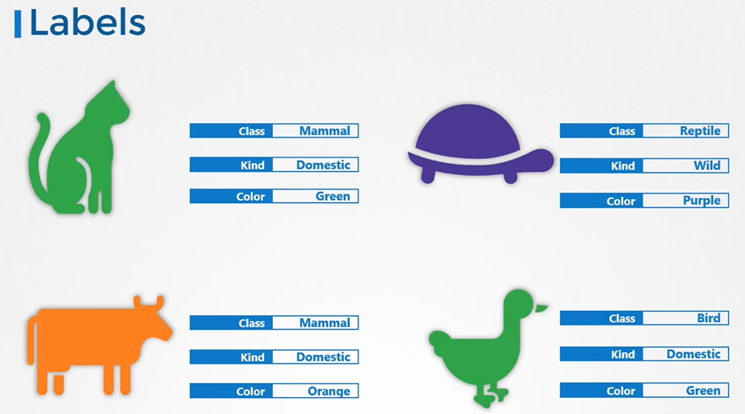
  
#### Selectors help you to filter these items
 
  
  
How are labels and selectors are used in kubernetes?
- We have created different types of objects in kubernetes such as **`PODs`**, **`ReplicaSets`**, **`Deployments`** etc.
  
How do you specify labels?
   ```
    apiVersion: v1
    kind: Pod
    metadata:
     name: simple-webapp
     labels:
       app: App1
       function: Front-end
    spec:
     containers:
     - name: simple-webapp
       image: simple-webapp
       ports:
       - containerPort: 8080
   ```
 
 
Once the pod is created, to select the pod with labels run the below command
```
$ kubectl get pods --selector app=App1
```

Kubernetes uses labels to connect different objects together
   ```
    apiVersion: apps/v1
    kind: ReplicaSet
    metadata:
      name: simple-webapp
      labels:
        app: App1
        function: Front-end
    spec:
     replicas: 3
     selector:
       matchLabels:
        app: App1
    template:
      metadata:
        labels:
          app: App1
          function: Front-end
      spec:
        containers:
        - name: simple-webapp
          image: simple-webapp   
   ```

  

For services

      apiVersion: v1
      kind: Service
      metadata:
       name: my-service
      spec:
       selector:
         app: App1
       ports:
       - protocol: TCP
         port: 80
         targetPort: 9376 

  
  
## Annotations
- While labels and selectors are used to group objects, annotations are used to record other details for informative purpose.

    ```
    apiVersion: apps/v1
    kind: ReplicaSet
    metadata:
      name: simple-webapp
      labels:
        app: App1
        function: Front-end
      annotations:
         buildversion: 1.34
    spec:
     replicas: 3
     selector:
       matchLabels:
        app: App1
    template:
      metadata:
        labels:
          app: App1
          function: Front-end
      spec:
        containers:
        - name: simple-webapp
          image: simple-webapp   
    ```
  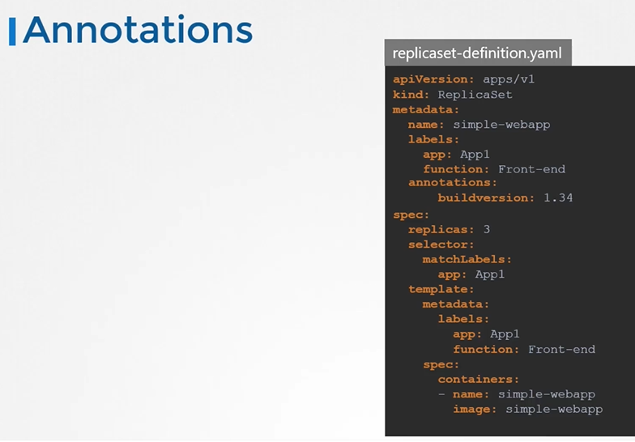

K8s Reference Docs:
- https://kubernetes.io/docs/concepts/overview/working-with-objects/labels/

<br><br><br>

# Taints and Tolerations
  - Take me to [Video Tutorial](https://kodekloud.com/topic/taints-and-tolerations-2/)
  
In this section, we will take a look at taints and tolerations.
- Pod to node relationship and how you can restrict what pods are placed on what nodes.

#### Taints and Tolerations are used to set restrictions on what pods can be scheduled on a node. 
- Only pods which are tolerant to the particular taint on a node will get scheduled on that node.

  
  
## Taints
- Use **`kubectl taint nodes`** command to taint a node.

  Syntax
  ```
  $ kubectl taint nodes <node-name> key=value:taint-effect
  ```
 
  Example
  ```
  $ kubectl taint nodes node1 app=blue:NoSchedule
  ```
  
- The taint effect defines what would happen to the pods if they do not tolerate the taint.
- There are 3 taint effects
  - **`NoSchedule`**
  - **`PreferNoSchedule`**
  - **`NoExecute`**
  
  
  
## Tolerations
   - Tolerations are added to pods by adding a **`tolerations`** section in pod definition.
     ```
     apiVersion: v1
     kind: Pod
     metadata:
      name: myapp-pod
     spec:
      containers:
      - name: nginx-container
        image: nginx
      tolerations:
      - key: "app"
        operator: "Equal"
        value: "blue"
        effect: "NoSchedule"
     ```
    
  
    

#### Taints and Tolerations do not tell the pod to go to a particular node. Instead, they tell the node to only accept pods with certain tolerations.
- To see this taint, run the below command
  ```
  $ kubectl describe node kubemaster |grep Taint
  ```
 
 
  
     
#### K8s Reference Docs
- https://kubernetes.io/docs/concepts/scheduling-eviction/taint-and-toleration/

<br><br><br>

# Node Selectors
  - Take me to [Video Tutorial](https://kodekloud.com/topic/node-selectors/)

In this section, we will take a look at Node Selectors in Kubernetes

#### We add new property called Node Selector to the spec section and specify the label.
- The scheduler uses these labels to match and identify the right node to place the pods on.
  ```
  apiVersion: v1
  kind: Pod
  metadata:
   name: myapp-pod
  spec:
   containers:
   - name: data-processor
     image: data-processor
   nodeSelector:
    size: Large
  ```

  
- To label nodes

  Syntax
  ```
  $ kubectl label nodes <node-name> <label-key>=<label-value>
  ```
  Example
  ```
  $ kubectl label nodes node-1 size=Large
  ```
  

  
- To create a pod definition
  ```
  apiVersion: v1
  kind: Pod
  metadata:
   name: myapp-pod
  spec:
   containers:
   - name: data-processor
     image: data-processor
   nodeSelector:
    size: Large
  ```
  ```
  $ kubectl create -f pod-definition.yml
  ```
  

  
## Node Selector - Limitations
- We used a single label and selector to achieve our goal here. But what if our requirement is much more complex.
  

 
- For this we have **`Node Affinity and Anti Affinity`**
  
#### K8s Reference Docs
- https://kubernetes.io/docs/concepts/scheduling-eviction/assign-pod-node/#nodeselector

<br><br><br>

# Node Affinity
  - Take me to the [Video Tutorial](https://kodekloud.com/topic/node-affinity-2/)
  
In this section, we will talk about "Node Affinity" feature in kubernetes.

#### The primary feature of Node Affinity is to ensure that the pods are hosted on particular nodes.
- With **`Node Selectors`** we cannot provide the advance expressions.
  ```
  apiVersion: v1
  kind: Pod
  metadata:
   name: myapp-pod
  spec:
   containers:
   - name: data-processor
     image: data-processor
   nodeSelector:
    size: Large
  ```
  
  ```
  apiVersion: v1
  kind: Pod
  metadata:
   name: myapp-pod
  spec:
   containers:
   - name: data-processor
     image: data-processor
   affinity:
     nodeAffinity:
       requiredDuringSchedulingIgnoredDuringExecution:
          nodeSelectorTerms:
          - matchExpressions:
            - key: size
              operator: In
              values: 
              - Large
              - Medium
  ```
  
  
  ```
  apiVersion: v1
  kind: Pod
  metadata:
   name: myapp-pod
  spec:
   containers:
   - name: data-processor
     image: data-processor
   affinity:
     nodeAffinity:
       requiredDuringSchedulingIgnoredDuringExecution:
          nodeSelectorTerms:
          - matchExpressions:
            - key: size
              operator: NotIn
              values: 
              - Small
  ```
  
  
  ```
  apiVersion: v1
  kind: Pod
  metadata:
   name: myapp-pod
  spec:
   containers:
   - name: data-processor
     image: data-processor
   affinity:
     nodeAffinity:
       requiredDuringSchedulingIgnoredDuringExecution:
          nodeSelectorTerms:
          - matchExpressions:
            - key: size
              operator: Exists
  ```
  
  
  

## Node Affinity Types
- Available
  - requiredDuringSchedulingIgnoredDuringExecution
  - preferredDuringSchedulingIgnoredDuringExecution
- Planned
  - requiredDuringSchedulingRequriedDuringExecution
  - preferredDuringSchedulingRequiredDuringExecution
  
  
  
## Node Affinity Types States

  
  
  
  
#### K8s Reference Docs
- https://kubernetes.io/docs/tasks/configure-pod-container/assign-pods-nodes-using-node-affinity/
- https://kubernetes.io/blog/2017/03/advanced-scheduling-in-kubernetes/

<br><br><br>

# Taints and Tolerations vs Node Affinity
  - Take me to [Video Tutorial](https://kodekloud.com/topic/taints-and-tolerations-vs-node-affinity/)

In this section, we will take a look at Taints and Tolerations vs Node Affinity
- Taints and Tolerations do not guarantee that the pods will only prefer these nodes; in this case, the red pods may end up on one of the other nodes that do not have a taint or toleration set.
  
  
  
 
- As such, a combination of taints and tolerations and node affinity rules can be used together to completely dedicate nodes for specific parts.

  

  
#### K8s Reference Docs:
- https://kubernetes.io/docs/concepts/scheduling-eviction/taint-and-toleration/
- https://kubernetes.io/docs/tasks/configure-pod-container/assign-pods-nodes-using-node-affinity/

<br><br><br>

# Resource Limits
  - Take me to [Video Tutorials](https://kodekloud.com/topic/resource-limits/)
  
In this section we will take a look at Resource Limits

#### Let us take a look at 3 node kubernetes cluster.
- Each node has a set of CPU, Memory and Disk resources available.
- If there is no sufficient resources available on any of the nodes, kubernetes holds the scheduling the pod. You will see the pod in pending state. If you look at the events, you will see the reason as insufficient CPU.
  
  
  
## Resource Requirements
- By default, K8s assume that a pod or container within a pod requires **`0.5`** CPU and **`256Mi`** of memory. This is known as the **`Resource Request` for a container**.
  
  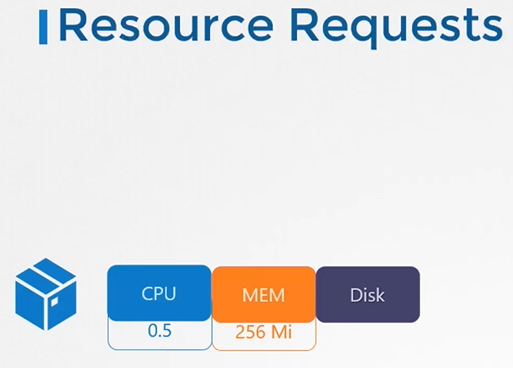
  
- If your application within the pod requires more than the default resources, you need to set them in the pod definition file.

  ```
  apiVersion: v1
  kind: Pod
  metadata:
    name: simple-webapp-color
    labels:
      name: simple-webapp-color
  spec:
   containers:
   - name: simple-webapp-color
     image: simple-webapp-color
     ports:
      - containerPort:  8080
     resources:
       requests:
        memory: "1Gi"
        cpu: "1"
  ```
   
   
## Resources - Limits
- By default, k8s sets resource limits to 1 CPU and 512Mi of memory
  
  
  
- You can set the resource limits in the pod definition file.
  
  ```
  apiVersion: v1
  kind: Pod
  metadata:
    name: simple-webapp-color
    labels:
      name: simple-webapp-color
  spec:
   containers:
   - name: simple-webapp-color
     image: simple-webapp-color
     ports:
      - containerPort:  8080
     resources:
       requests:
        memory: "1Gi"
        cpu: "1"
       limits:
         memory: "2Gi"
         cpu: "2"
  ```
  
  
#### Note: Remember Requests and Limits for resources are set per container in the pod.
  
## Exceed Limits
- what happens when a pod tries to exceed resources beyond its limits?

   
   
  
#### K8s Reference Docs:
- https://kubernetes.io/docs/concepts/configuration/manage-resources-containers/
  
<br><br><br>