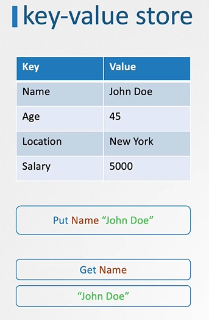

# **CKA** (Last Min Notes)

# Cluster Architecture

  - Take me to [Video Tutorial](https://kodekloud.com/topic/cluster-architecture/)

In this section , we will take a look at the kubernetes Architecture at high level.
- 10,000 Feet Look at the Kubernetes Architecture
  
  

K8s Reference Docs:
- https://kubernetes.io/docs/concepts/architecture/

<br ><br >
# ETCD for Beginners
  - Take me to the [Video Tutorial](https://kodekloud.com/topic/etcd-for-beginners/)


  
 ## What is a ETCD?
     - ETCD is a distributed reliable key-value store that is simple, secure & Fast.
     
## What is a Key-Value Store
   - Traditionally, databases have been in tabular format, you must have heared about SQL or Relational databases. They store data in rows and columns
       
     
   - A Key-Value Store stores information in a Key and Value format.
       
     
       
## Install ETCD
   - Its easy to install and get started with **`ETCD`**.
     - Download the relevant binary for your operating system from github releases page (https://github.com/etcd-io/etcd/releases)
       ```
       For Example: To download ETCD V3.3.11, run the below curl command
         
       $ https://github.com/etcd-io/etcd/releases/download/v3.3.11/etcd-v3.3.11-linux-amd64.tar.gz
       ```
     - Extract it.
       ```
       $ tar xvzf etcd-v3.3.11-linux-amd64.tar.gz 
       ```
     - Run the ETCD Service
       ```
       $ ./etcd
       ```
     - When you start **`ETCD`** it will by default listens on port **`2379`**
      - The default client that comes with **`ETCD`** is the [**`etcdctl`**](https://github.com/etcd-io/etcd/tree/main/etcdctl) client. You can use it to store and retrieve key-value pairs.
        ```
        Syntax: To Store a Key-Value pair
        $ ./etcdctl set key1 value1
        ```
        ```
        Syntax: To retrieve the stored data
        $ ./etcdctl get key1
        ```
        ```
        Syntax: To view more commands. Run etcdctl without any arguments
        $ ./etcdctl
        ```
        
        
        
       K8s Reference Docs:
       - https://kubernetes.io/docs/concepts/overview/components/
       - https://etcd.io/docs/
       - https://kubernetes.io/docs/tasks/administer-cluster/configure-upgrade-etcd/

  <br><br>

  # ETCD in Kubernetes
  - Take me to [Video Tutorial](https://kodekloud.com/topic/etcd-in-kubernetes/)

In this section, we will take a look at ETCD role in kubernetes

## ETCD Datastore
- The ETCD Datastore stores information regarding the cluster such as **`Nodes`**, **`PODS`**, **`Configs`**, **`Secrets`**, **`Accounts`**, **`Roles`**, **`Bindings`** and **`Others`**.
- Every information you see when you run the **`kubectl get`** command is from the **`ETCD Server`**.

## Setup - Manual
- If you setup your cluster from scratch then you deploy **`ETCD`** by downloading ETCD Binaries yourself
- Installing Binaries and Configuring ETCD as a service in your master node yourself.
  ```
  $ wget -q --https-only "https://github.com/etcd-io/etcd/releases/download/v3.3.11/etcd-v3.3.11-linux-amd64.tar.gz"
  ```

  
  
## Setup - Kubeadm
- If you setup your cluster using **`kubeadm`** then kubeadm will deploy etcd server for you as a pod in **`kube-system`** namespace.
  ```
  $ kubectl get pods -n kube-system
  ```
  

## Explore ETCD
- To list all keys stored by kubernetes, run the below command
  ```
  $ kubectl exec etcd-master -n kube-system etcdctl get / --prefix -key
  ```
- Kubernetes Stores data in a specific directory structure, the root directory is the **`registry`** and under that you have varies kubernetes constructs such as **`minions`**, **`nodes`**, **`pods`**, **`replicasets`**, **`deployments`**, **`roles`**, **`secrets`** and **`Others`**.
  
  

## ETCD in HA Environment
   - In a high availability environment, you will have multiple master nodes in your cluster that will have multiple ETCD Instances spread across the master nodes.
   - Make sure etcd instances know each other by setting the right parameter in the **`etcd.service`** configuration. The **`--initial-cluster`** option where you need to specify the different instances of the etcd service.
     

K8s Reference Docs:
- https://kubernetes.io/docs/tasks/administer-cluster/configure-upgrade-etcd/
- https://kubernetes.io/docs/setup/production-environment/tools/kubeadm/setup-ha-etcd-with-kubeadm/
- https://kubernetes.io/docs/setup/production-environment/tools/kubeadm/high-availability/#stacked-control-plane-and-etcd-nodes
- https://kubernetes.io/docs/setup/production-environment/tools/kubeadm/high-availability/#external-etcd-nodes

<br><br>
